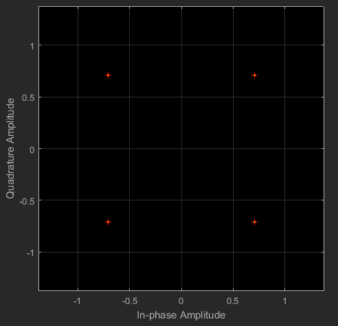

# **Digital Communications Project**
Simulating the performance of different modulation schemes, such as, [**BPSK**](#binary-phase-shift-keying-modulation-bpsk), [**QPSK**](#quadrature-phase-shift-keying-modulation-qpsk), [**FSK**](#frequency-shift-keying-fsk), [**QAM**](#frequency-shift-keying-fsk) in an Additive White Gaussian Noise, AWGN environment.

## Simulation Environment Settings
- The simulation is done using 2 different parameter sets defined below.
    * **Set 0**: Sample Time = 0.1 s, Samples Per Frame = 100
    * **Set 1**: Sample Time = 1 s, Samples Per Frame = 100
- The noise level is set to 10 dB.
- The simulation period is set to 100. 
- Integer Random Generator seed is set to Auto.
- Noise initial random seed is set to 67.

## **Binary Phase-Shift Keying Modulation (BPSK)**
### - Definition 
BPSK is a two phase modulation scheme, where the 0’s and 1’s in a binary message are represented by two different phase states in the carrier signal: theta = 0 for binary 1 and theta = 180 for binary 0.

### - Schematic
```
Random Generator set size = 2
Phase offset (rad) = 0
```


### - Pre-Modulation Scatter Plots
* Parameter Set 0:

     
* Parameter Set 1:

     
### - Post-Modulation Scatter Plots
* Parameter Set 0: 

     
* Parameter Set 1:

     
### - BER Diagram
* Simulation 0 (green) is using parameter set 0.
* Simulation 1 (red) is using parameter set 1.

    

___
## **Quadrature Phase-Shift Keying Modulation (QPSK)**
### - Definition 
QPSK is a form of Phase Shift Keying in which two bits are modulated at once, selecting one of four possible carrier phase shifts (0, 90, 180, 270). QPSK allows the signal to carry twice as much information as ordinary PSK using the same bandwidth.
### - Schematic
```
Random Generator set size = 4
Phase offset (rad) = pi/4
``` 
 
### - Pre-Modulation Scatter Plots
* Parameter Set 0:

     
* Parameter Set 1:

     
### - Post-Modulation Scatter Plots
* Parameter Set 0: 

     
* Parameter Set 1:

     
### - BER Diagram
* Simulation 0 (green) is using parameter set 0.
* Simulation 1 (red) is using parameter set 1.

    

___
## **Frequency Shift Keying (FSK)**
### - Definition 
FSK is the frequency modulation system in which digital information is transmitted through the discrete frequency change of a carrier wave. The simplest FSK is binary FSK (BFSK).
### - Schematic
```
Random Generator set size = 2
M-ary number = 2
Frequency separation = 6 Hz
Samples per symbol = 17
``` 
 
### - Pre-Modulation Scatter Plots
* Parameter Set 0:

     
* Parameter Set 1:

     
### - Post-Modulation Scatter Plots
* Parameter Set 0: 

     
* Parameter Set 1:

     
### - BER Diagram
* Simulation 0 (green) is using parameter set 0.
* Simulation 1 (red) is using parameter set 1.

    

___
## **Quadrature Amplitude Modulation (QAM)**
### - Definition
QAM is a signal in which two carriers shifted in phase by 90 degrees (i.e. sin and cos) are modulated and combined. As a result of their 90 phase difference they are in quadrature and this gives rise to the name. Often one signal is called the In-phase or I signal, and the other is the quadrature or Q signal. 
### - Types
* QAM 16
* QAM 64
### - Schematic
```
- Random Generator set size = 16, 64
- M-ary number = 16, 64
- Normalization method = Average Power
- Phase offset (rad) = 0
- Average power referenced to 1 Ohm = 1 Watts
``` 
* **QAM 16**

    

* **QAM 64**

     
### - Pre-Modulation Scatter Plots
* **QAM 16**:
    * Parameter Set 0

        
    * Parameter Set 1

        
* **QAM 64**
    * Parameter Set 0

        
    * Parameter Set 1

        
### - Post-Modulation Scatter Plots
* **QAM 16**:
    * Parameter Set 0

        
    * Parameter Set 1

        
* **QAM 64**
    * Parameter Set 0

        
    * Parameter Set 1

        
### - BER Diagram
* Simulation 0 (green) is using parameter set 0.
* Simulation 1 (red) is using parameter set 1.

    * **QAM 16**

        
    * **QAM 64**

        
